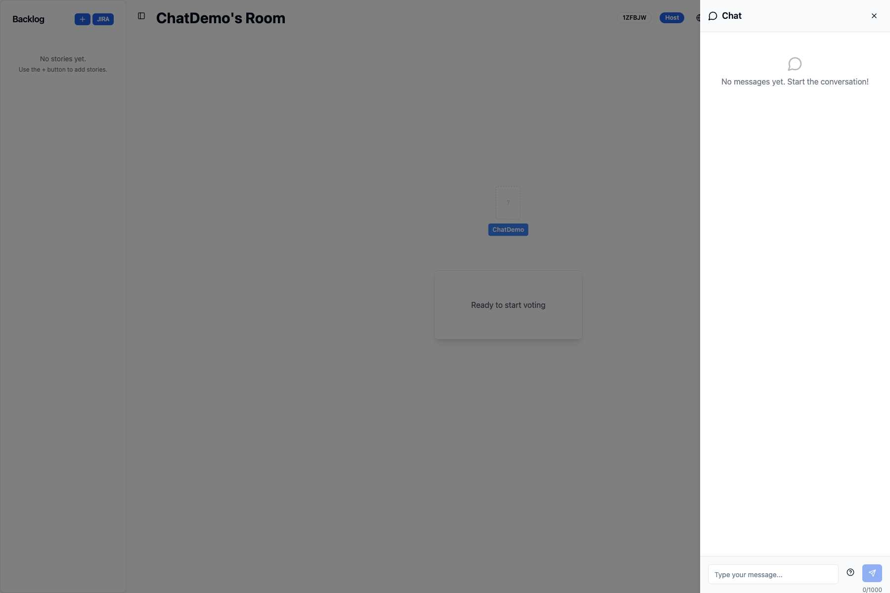
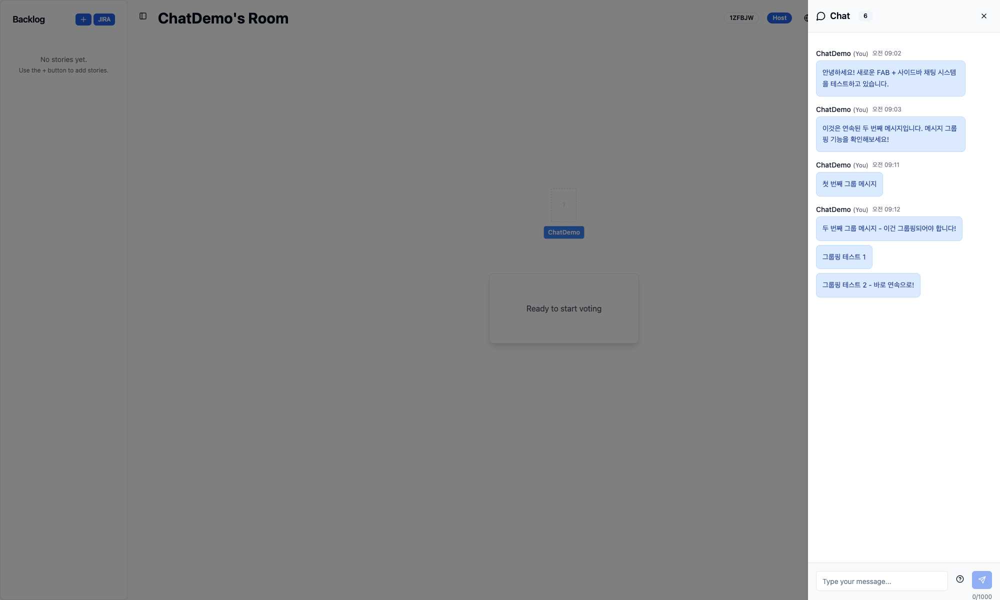
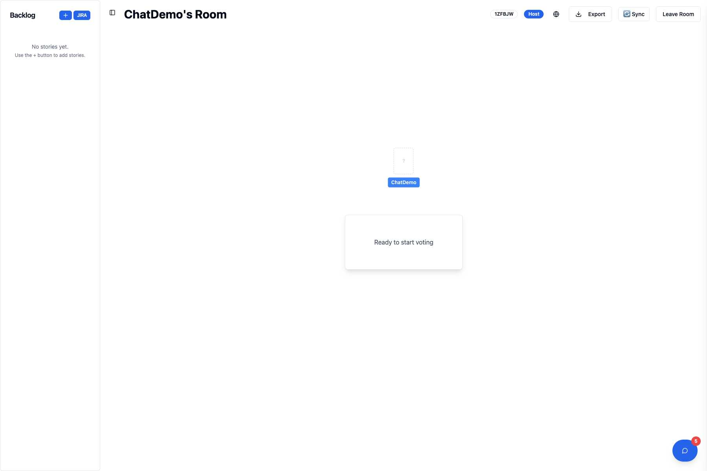

# Add Real-time Chat Feature with FAB and Sidebar UI

## 🎯 Overview
Implements a comprehensive real-time chat system for Planning Poker rooms with an improved user experience using a floating action button (FAB) and slide-in sidebar design.

## ✨ Key Features

### 🔥 New UI/UX Improvements
- **Floating Action Button (FAB)**: Clean, non-intrusive chat access from bottom-right corner
- **Slide-in Sidebar**: Chat panel slides in from the right with backdrop overlay
- **Unread Message Counter**: Real-time badge showing unread message count on FAB
- **Automatic Chat History Loading**: New users immediately see previous conversations

### 💬 Core Chat Functionality
- **Real-time Messaging**: WebSocket-based instant communication
- **Rich Text Formatting**: Support for **bold**, *italic*, and `code` formatting
- **Typing Indicators**: See when others are typing
- **Message Persistence**: Chat history preserved across sessions
- **Message Grouping**: Consecutive messages from same user are grouped with reduced spacing
- **Smart Message Alignment**: Own messages on left, others' messages on right

### 🔧 Technical Improvements
- **Optimized State Management**: Improved unread message tracking and chat state
- **Better WebSocket Handling**: Enhanced chat history synchronization
- **Performance Optimizations**: Reduced redundant API calls and improved rendering

## 🏗️ Implementation Details

### Frontend Components
- `ChatFAB.tsx` - Floating action button with unread count badge
- `ChatSidebar.tsx` - Slide-in chat interface with full functionality
- Enhanced `RoomPage.tsx` - Integration of new chat system
- Improved `RoomContext.tsx` - Automatic chat history loading

### Backend Enhancements  
- Enhanced WebSocket chat message handlers
- Improved chat history persistence and retrieval
- Better typing indicator management

### Dependencies
- `marked` - Markdown parsing for rich text formatting
- `dompurify` - XSS protection for safe HTML rendering

## 🧪 Testing Instructions

1. **Create/Join Room**: Start or join a Planning Poker room
2. **FAB Interaction**: Notice the blue chat button in bottom-right corner
3. **Send Messages**: Click FAB to open sidebar and send messages
4. **Test New User Experience**: 
   - Join with another user
   - Verify chat history loads immediately
   - Check unread message counter works
5. **UI/UX Testing**:
   - Test FAB show/hide unread count
   - Verify sidebar slide animation
   - Test backdrop click to close
   - Check message grouping and alignment

## 🔄 Migration from Old UI
- Replaced embedded ChatPanel with FAB + Sidebar system
- Maintains all existing functionality while improving user experience
- No breaking changes to existing chat data or API

## 🔗 Related Issue
Closes #2 - Chat feature development

## 📸 Visual Changes

### Screenshots

| Feature | Screenshot | Description |
|---------|------------|-------------|
| **Clean FAB State** |  | Clean interface with only the blue FAB visible in bottom-right corner |
| **Empty Chat Sidebar** |  | Chat sidebar slides in from right with backdrop overlay and empty state message |
| **Chat Messages** |  | Messages displayed with user info and timestamps, left-aligned for own messages |
| **FAB with Unread Badge** |  | FAB displays red badge with "1" showing unread message count |

### Key Visual Improvements
- ✅ Clean, unobtrusive chat access via FAB
- ✅ Modern sidebar with smooth animations  
- ✅ Improved message layout and grouping
- ✅ Better mobile and desktop experience
- ✅ Real-time unread message counter
- ✅ Smart message alignment (own messages left, others right)