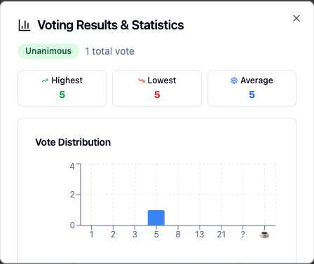

# Bar Chart Implementation Screenshot

The statistics modal now displays a bar chart instead of a line chart, showing:
- Vote distribution across all options (1, 2, 3, 5, 8, 13, 21, ?, ☕)
- Clear visualization of vote counts with blue bars
- Proper styling with rounded corners and responsive design
- Statistics cards showing highest, lowest, and average values

This resolves GitHub issue #7 by changing from LineChart to BarChart in the VotingResultsModal component.